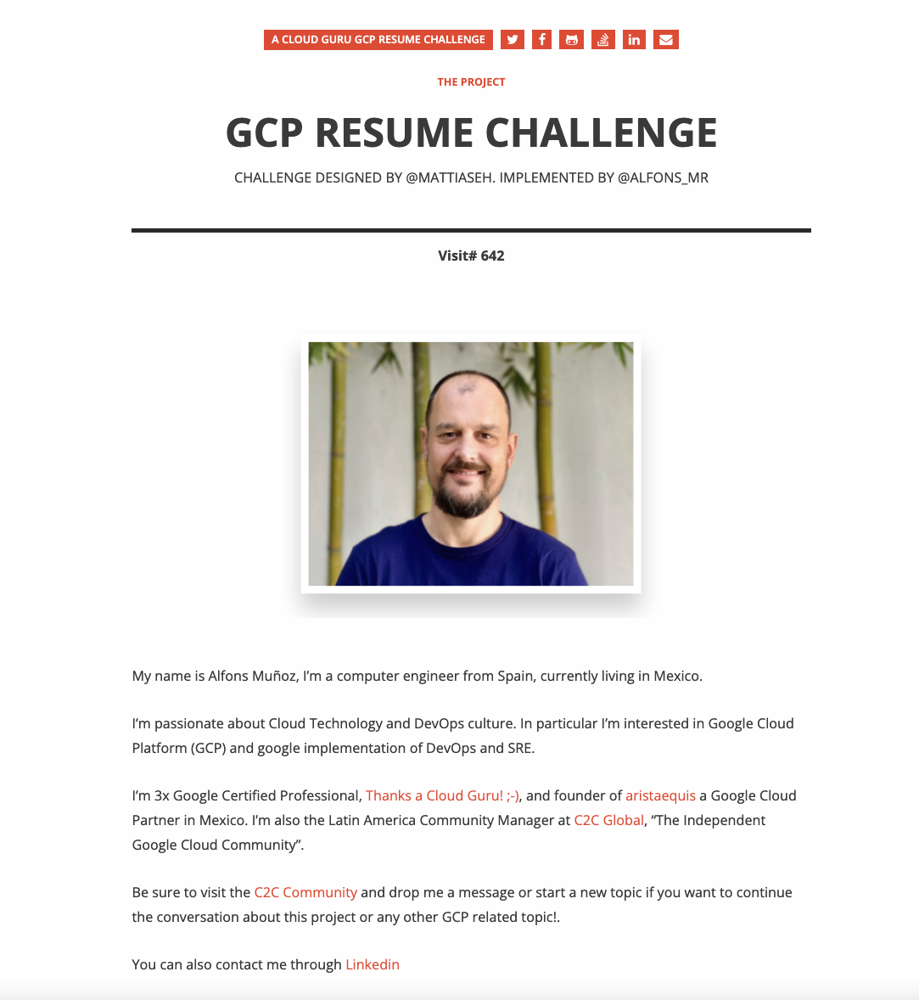
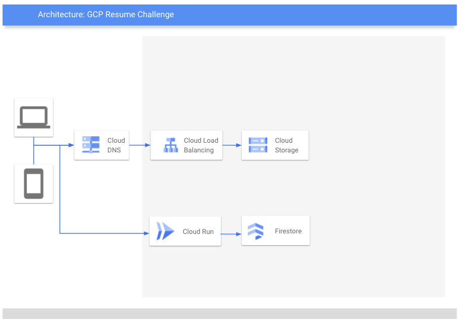

[![Contributors][contributors-shield]][contributors-url]
[![Forks][forks-shield]][forks-url]
[![Stargazers][stars-shield]][stars-url]
[![Issues][issues-shield]][issues-url]
[![MIT License][license-shield]][license-url]

[![LinkedIn][linkedin-shield]][linkedin-url]

<!-- PROJECT LOGO -->
 

  

  <h3 align="center">Google Cloud Platform (GCP) Resume Challenge - aCloudGuru</h3>

  

    Build a serverless resume / personal brand website on GCP with API backend and GitOps-based CI/CD
     
    <a href="https://acloudguru.com/blog/engineering/cloudguruchallenge-your-resume-on-gcp" target="_blank"><strong>See challenge description by Mattias Andersson @CloudGuru »</strong></a>
     
     
    <a href="https://gcp-resume-challenge.alfonsmr.com/" target="_blank">View Demo</a>
     
    <a href="https://github.com/alfonsmr/gcp-resume-challenge-frontend/issues">Report Bug</a>
    ·
    <a href="https://github.com/alfonsmr/gcp-resume-challenge-frontend/issues">Request Feature</a>
  

## The Project

<!-- ABOUT THE PROJECT -->
### Frontend Design

<!-- PROJECT IMAGE -->
 

  

 

### Project Diagram

 

  

 

In this project we are going to build a personal brand website on GCP with an API backend and Gitops-based CI/CD. We will be able to monitor our project with Google Cloud Operations.

This project is my personal implementation of the challenge that Mattias Andersson from a Cloud Guru launched on August 2021.

Look at original [Your resume on GCP](https://acloudguru.com/blog/engineering/cloudguruchallenge-your-resume-on-gcp) challenge instrucctions before looking at this repo code to have a real challenge yourself.

This repository holds the README file for the whole project and the frontend code. 

The repository for the Backend can be found at [gcp-resume-challenge-backend](https://github.com/alfonsmr/gcp-resume-challenge-backend)

The Repository for the GitOps-based CI/CD is stored privately CSR in the backend GCP Project.

### Built With

This project uses the following GCP products and technologies:

* Compute & Containers
  * [Cloud Run](https://cloud.google.com/run)
  * [Container Registry](https://cloud.google.com/container-registry)
  * [Container Security](https://cloud.google.com/anthos/security)
* Databases
  * [Firestore](https://cloud.google.com/firestore)
* Developer Tools
  * [Cloud Build](https://cloud.google.com/cloud-build)
  * [Cloud Source Repository](https://cloud.google.com/source-repositories)
* Management Tools
  * [Cloud Shell](https://cloud.google.com/shell)
  * [Cloud Console](https://cloud.google.com/cloud-console)
* Networking
  * [Cloud Armor](https://cloud.google.com/armor)
  * [Cloud CDN](https://cloud.google.com/cdn)
  * [Cloud Domains](https://cloud.google.com/domains/docs)
  * [Cloud DNS](https://cloud.google.com/dns)
  * [Cloud Load Balancing](https://cloud.google.com/load-balancing)
* Operations
  * [Cloud Debuger](https://cloud.google.com/debugger)
  * [Cloud Logging](https://cloud.google.com/logging)
  * [Cloud Monitoring](https://cloud.google.com/monitoring)
  * [Cloud Profiler](https://cloud.google.com/profiler)
  * [Cloud Trace](https://cloud.google.com/trace)
* Security and Identity
  * [Firewalls](https://cloud.google.com/firewalls)
  * [Cloud Identity](https://cloud.google.com/identity)
* Storage
  * [Cloud Storage](https://cloud.google.com/storage)

The frontend is developed with:

* [Hugo](https://gohugo.io/)

The code repository and versioning is done with Github.

The frontend uses Google Analytics.

The GitOps code for the backend is kept in a private Google Cloud Source repositoy.

### The Author

My name is Alfons Muñoz, I'm a computer engineer from Spain, currently living in Mexico. 

I'm passionate about Cloud Technology and DevOps culture. In particular I'm interested in Google Cloud Platform (GCP) and google implementation of DevOps and SRE. I'm 3x Google Certified Professional, [Thanks a Cloud Guru! ;-)](https://learn.acloud.guru/profile/alfonsmr), and founder of [aristaequis](http://www.aristaequis.com) a Google Cloud Partner in Mexico. I'm also the Latin America Community Manager at [C2C Global](https://bit.ly/3AJLbrI), "The Independent Google Cloud Community".

Be sure to visit the [C2C Community](https://bit.ly/3AJLbrI) and drop me a message or start a new topic if you want to continue the conversation about this project or any other GCP related topic!.

You can also contact me through [Linkedin](https://www.linkedin.com/in/alfonsmr/)

## The Project

### The Frontend

The frontend is developed using [HUGO](https://gohugo.io/), Hugo is a general-purpose website framework. Hugo is a static site generator. Unlike systems that dynamically build a page with each visitor request, Hugo builds pages when you create or update your content. In technical terms, Hugo takes a source directory of files and templates and uses these as input to create a complete website.

I used [Ghostwriter](https://themes.gohugo.io/themes/ghostwriter/) a Hugo template created by [Juraj Bubniak](https://github.com/jbub) as the starting point for my website.

The website consist of main page at (https://gcp-resume-challenge.alfonsmr.com/), this is the "Personal brand" webpage and contains:
* My name and a Linkedin profile
* a link to my GCP Certifications 
* A Link to my profile at A Cloud Guru
* A visitor counter that uses the backend to store and retrieve a vistor counter.
* A subpage with a description of the challenge/project

#### The development proccess

The website is developed locally using VS Code and the changes are pushed to a github repository. We use the "hugo" command to build and see the website but we are not going to push the "public" directory into the repository. we are going to build and publish the website with Google Cloud Build from the repository.

We don't need to modify any of the Go templates because we are doing minor changes or adding content using only html, css and js.

In the main index.html page we include a JQuery Javascript that calls our backend, retrieves the counter value and displays it on the webpage. 

We also add the static content for the main page and the description of the project in a subpage of the site. 

#### Hosting the Site

We will put our final files in a Google Cloud Storage bucket, well, CloudBuild will do that, but we need to prepare the bucket.
Not all buckets can serve static files as webpages, so be sure to follow the following documentation to set up all the correct parameters.

[Hosting a static website](https://cloud.google.com/storage/docs/hosting-static-website)
[Static website examples and tips](https://cloud.google.com/storage/docs/static-website)

Name your bucket exactly as the url you are going to call later. e.g if your domain is "www.example.com" your bucket should be named "www.example.com"

#### Using your own domain

I used a domain I own, if you don't have one you can get one with Google at [Cloud Domains](https://cloud.google.com/domains).

As I have one already I just point my name servers to google and I can start using [Cloud DNS](https://cloud.google.com/dns) to manage it.

You will point your desired record name to the load balancer you are creating in later steps.

We are using a load balancer to get HTTPS over our bucket files.

You can later add here easy to manage names for acces the backend, like api.mydomain.com

#### Using HTTPS

We are setting up a load balancer, which final destination will be our bucket.

Follow the following document to set up the load balancer and the bucket backend.

* [Setting up a load balancer with backend buckets](https://cloud.google.com/load-balancing/docs/https/ext-load-balancer-backend-buckets)

#### Using Cloud CDN

To server content closer to the user requesting it and have a cache we will use [Cloud CDN](https://cloud.google.com/cdn/docs/overview)

To enable Cloud CDN for our HTTPS Load Balancer see the following documentation:

* [Setting up Cloud CDN with a backend bucket](https://cloud.google.com/cdn/docs/setting-up-cdn-with-bucket)

#### The CI/CD process

Now that we have everything in place we will setup a CloudBuild action that builds and publishes our site everytinme we change our webpage and push the changes to Github. CloudBuild will be also repsonsible to invalidate the CDN cache every time it runs so we can be sure users are getting our most recent changes.

Cloudbuild will:

* Download Hugo executable and build our website from our Github files
* Copy the built website into the GCS Bucket
* Invalidate the CDN cache

You can follow this documentation to see how Cloubuild works:

* [Overview of Cloud Build](https://cloud.google.com/build/docs/overview)

You can see the cloudbuild.yaml file in this repository to see exactly which steps cloudbuild is doing and how.

### The Backend

The backend is written in Python using the Flask framework. The backend is responsible for:
* Update and retrieve the counter in Firestore every time it is called

#### The Cloud Run API

Our backend consist of a python program that uses the flask framework. It is stored as a container in Cloud Run.

When the fronend runs it makes a query to the Cloud Run python programm that retrieves the data from Firestore and pass it back to the frontend to display.

Google Cloud Run documentation for deploying a Python service:
[Build and deploy a Python service](https://cloud.google.com/run/docs/quickstarts/build-and-deploy/python)

#### The Firestore Database

I used firestore to keep track of the counter. Through [Firebase Console](https://firebase.google.com/) I created a Colection with a single document with a field on it. It stores the number of visits.
Using the firebase console you will need to download the firebase API key that will be used by the flask API to access and write to Firebase database.

More info on using Firestore with Flask:
* [Building a Flask(Python) CRUD API with Cloud Firestore(Firebase) and Deploying on Cloud Run](https://medium.com/google-cloud/building-a-flask-python-crud-api-with-cloud-firestore-firebase-and-deploying-on-cloud-run-29a10c502877)

#### Store the code in Github

The code from the python programm is stored in Github. It is Cloud Build the responsible to build the container, using the Dockerfile.

#### Using Cloud Source Repositories (CSR)

The app will use a GitOps-Style Iac (see more about GitOps in next section), This Iac (Infraestructure as Code) holds very sensitive information and does not have any advantage to store it in GitHub so we use the equivalent Cloud Source Repositories (CSR) to store the templates. 

#### The GitOps Implementation

I am using GitOps-style Iac. When I push a change to the app repository (this is the Python app), the Cloud Build pipeline runs tests, builds a container image, and pushes it to Container Registry. After pushing the image, Cloud Build updates the template used to deploy the app as a Cloud Run Container, and pushes it to the env repository. This triggers another Cloud Build pipeline that uses the template to create the Cloud Run Container, if successful, stores the template file in another branch of the env repository.

This approach provides a way to control with revision control which template and image was used exactly for the deployment, at the same time you can redeploy or rollback any version of the app just pointing at the commit that has the template you want. Using this approach you can easily:

* Distinguish between failed and successful deployments by looking at the Cloud Build history,
* Access the manifest currently used by looking at the production branch of the env repository,
* Rollback to any previous version by re-executing the corresponding Cloud Build build.

More information about GitOps-style with Cloud Build can be found at [GitOps-style continuous delivery with Cloud Build](https://cloud.google.com/kubernetes-engine/docs/tutorials/gitops-cloud-build)

#### The CI/CD process

The CI/CD process for the backend is more complicated than the one for the frontend but also much more powerful. I used 2 pipelines.

The first one or "app pipeline", it is responsible to build the artifacts or containers that we are going to use to deploy our application into Cloud Run. To do that the pipelin builds a container that is pushed to the container registry and a new template is generated with the parameters to deploy the new container to Cloud Run. This new templated is stored in Google CSR.

The second pipeline or "env pipeline" detects that new template in the Google CSR and deploys it to Cloud Run, if successful the new template gets commited to production branch.

## Roadmap

Things missing in the project due to time constraints that I would like to implement in the future

* Add unit-test code for the frontend
* Improve the unit-test code for the backend
* Add terraform Iac to be able to create the project from scratch
* Define and add an SLO for the backend
* Merge the forntend and backend into a single repo
* Use environment variables and git branches to be able to deploy to dev staging and prod environments on demmand.
* Make a step-by-step guide to implement the project

See the [open issues](https://github.com/alfonsmr/gcp-resume-challenge-frontend/issues) for a list of proposed features (and known issues).

## Contributing

Contributions are what make the open source community such an amazing place to be learn, inspire, and create. Any contributions you make are **greatly appreciated**.

1. Fork the Project
2. Create your Feature Branch (`git checkout -b feature/AmazingFeature`)
3. Commit your Changes (`git commit -m 'Add some AmazingFeature'`)
4. Push to the Branch (`git push origin feature/AmazingFeature`)
5. Open a Pull Request

## License

Distributed under the MIT License. See `LICENSE` for more information.

## Contact

Alfons Muñoz:
* [Twitter](https://twitter.com/alfons_mr)
* [Linkedin](https://www.linkedin.com/in/alfonsmr/)

[Project Frontend (this repo)](https://github.com/alfonsmr/gcp-resume-challenge-frontend)

[Project Backend](https://github.com/alfonsmr/gcp-resume-challenge-backend)

## Acknowledgements

This repo is my personal implementation of the challenge designed and presented by [Mattias Andersson](https://twitter.com/MattiasEh) at [A Cloud Guru](https://acloudguru.com/)

<!-- MARKDOWN LINKS & IMAGES -->
<!-- https://www.markdownguide.org/basic-syntax/#reference-style-links -->
[contributors-shield]: https://img.shields.io/github/contributors/alfonsmr/gcp-resume-challenge-frontend
[contributors-url]: https://github.com/alfonsmr/gcp-resume-challenge-frontend/graphs/contributors
[forks-shield]: https://img.shields.io/github/forks/alfonsmr/gcp-resume-challenge-frontend
[forks-url]: https://github.com/alfonsmr/gcp-resume-challenge-frontend/network/members
[stars-shield]: https://img.shields.io/github/stars/alfonsmr/gcp-resume-challenge-frontend
[stars-url]: https://github.com/alfonsmr/gcp-resume-challenge-frontend/stargazers
[issues-shield]: https://img.shields.io/github/issues/alfonsmr/gcp-resume-challenge-frontend
[issues-url]: https://github.com/alfonsmr/gcp-resume-challenge-frontend/issues
[license-shield]: https://img.shields.io/github/license/alfonsmr/gcp-resume-challenge-frontend
[license-url]: https://github.com/alfonsmr/gcp-resume-challenge-frontend/blob/master/LICENSE
[linkedin-shield]: https://img.shields.io/badge/-LinkedIn-black.svg?style=for-the-badge&logo=linkedin&colorB=555
[linkedin-url]: https://linkedin.com/in/alfonsmr