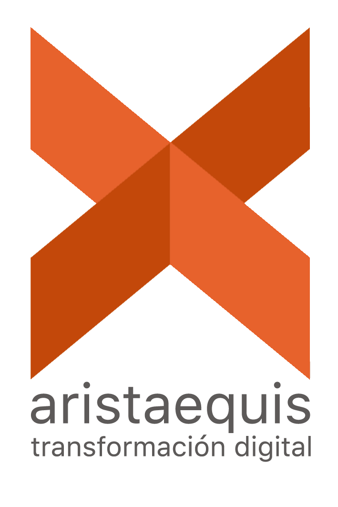
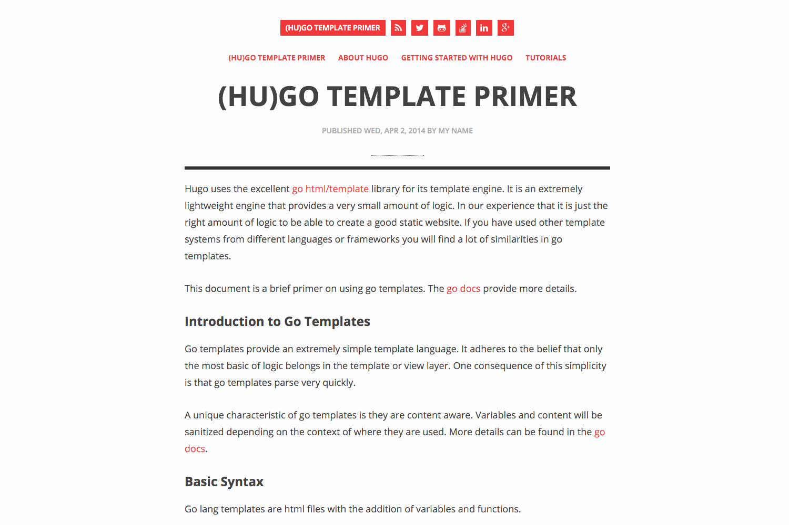

[![Contributors][contributors-shield]][contributors-url]
[![Forks][forks-shield]][forks-url]
[![Stargazers][stars-shield]][stars-url]
[![Issues][issues-shield]][issues-url]
[![MIT License][license-shield]][license-url]
[![LinkedIn][linkedin-shield]][linkedin-url]


<!-- PROJECT LOGO -->
<br />
<p align="center">
  <a href="https://github.com/alfonsmr/gcp-resume-challenge-frontend">
    
  </a>

  <h3 align="center">Google Cloud Platform (GCP) Resume Challenge - aCloudGuru</h3>

  <p align="center">
    Build a serverless resume / personal brand website on GCP with API backend and GitOps-based CI/CD
    <br />
    <a href="https://acloudguru.com/blog/engineering/cloudguruchallenge-your-resume-on-gcp"><strong>See challenge description by Mattias Andersson @CloudGuru »</strong></a>
    <br />
    <br />
    <a href="https://gcp-resume-challenge.alfonsmr.com/">View Demo</a>
    ·
    <a href="https://github.com/alfonsmr/gcp-resume-challenge-frontend/issues">Report Bug</a>
    ·
    <a href="https://github.com/alfonsmr/gcp-resume-challenge-frontend/issues">Request Feature</a>
  </p>
</p>


<!-- TABLE OF CONTENTS -->
<details open="open">
  <summary><h2 style="display: inline-block">Table of Contents</h2></summary>
  <ol>
    <li>
      <a href="#about-the-project">About The Project</a>
      <ul>
        <li><a href="#built-with">Built With</a></li>
      </ul>
    </li>
    <li>
      <a href="#getting-started">Getting Started</a>
      <ul>
        <li><a href="#prerequisites">Prerequisites</a></li>
        <li><a href="#installation">Installation</a></li>
      </ul>
    </li>
    <li><a href="#usage">Usage</a></li>
    <li><a href="#roadmap">Roadmap</a></li>
    <li><a href="#contributing">Contributing</a></li>
    <li><a href="#license">License</a></li>
    <li><a href="#contact">Contact</a></li>
    <li><a href="#acknowledgements">Acknowledgements</a></li>
  </ol>
</details>


<!-- ABOUT THE PROJECT -->
## About The Project

<!-- PROJECT IMAGE -->
<br />
<p align="center">
  <a href="https://github.com/alfonsmr/gcp-resume-challenge-frontend">
    
  </a>
</p>
<br />

You will build a serverless resume / personal brand website on GCP with API backend and GitOps-based CI/CD

In this challenge you will gain authentic experience with many skills, including coding, storage, compute, networking, source control, CI/CD, Serverless architecture, GitOps, and technical communication.

This project is my personal implementation of the challenge that A Cloud Guru launched on August 2021

Look at original "Your resume on GCP" challenge instrucctions before looking at this repo code to have a real challenge yourself.

See https://acloudguru.com/blog/engineering/cloudguruchallenge-your-resume-on-gcp for more information of the challenge.

This is the first part, the frontend part of the project
You will find the second part, the backend at https://github.com/alfonsmr/gcp-resume-challenge-backend

### Built With

This project uses the following GCP products and technologies:

* Compute & Containers
  * [Cloud Run](https://cloud.google.com/run)
  * [Container Registry](https://cloud.google.com/container-registry)
  * [Container Security](https://cloud.google.com/anthos/security)
* Databases
  * [Firestore](https://cloud.google.com/firestore)
* Developer Tools
  * [Cloud Build](https://cloud.google.com/cloud-build)
  * [Cloud Source Repository](https://cloud.google.com/source-repositories)
* Management Tools
  * [Cloud Shell](https://cloud.google.com/shell)
  * [Cloud Console](https://cloud.google.com/cloud-console)
* Networking
  * [Cloud Armor](https://cloud.google.com/armor)
  * [Cloud CDN](https://cloud.google.com/cdn)
  * [Cloud Domains](https://cloud.google.com/domains/docs)
  * [Cloud DNS](https://cloud.google.com/dns)
  * [Cloud Load Balancing](https://cloud.google.com/load-balancing)
* Operations
  * [Cloud Debuger](https://cloud.google.com/debugger)
  * [Cloud Logging](https://cloud.google.com/logging)
  * [Cloud Monitoring](https://cloud.google.com/monitoring)
  * [Cloud Profiler](https://cloud.google.com/profiler)
  * [Cloud Trace](https://cloud.google.com/trace)
* Security and Identity
  * [Firewalls](https://cloud.google.com/firewalls)
  * [Cloud Identity](https://cloud.google.com/identity)
* Storage
  * [Cloud Storage](https://cloud.google.com/storage)

The frontend also uses:

* [Hugo](https://gohugo.io/)

Apart from Google Cloud Source, the code is also stored in GitHub and the frontend uses Google Analytics.

The GitOps code is only stored in Google Cloud Source repositoy.

<!-- GETTING STARTED -->
## Getting Started

Apart from your code, everything will be stored in GCP products or Github.

### Prerequisites

You can use your own GCP account. If you don't have one you can set-up a trial one with access to a free tier and $300 in credit. [Free Trial and Free Tier.](https://cloud.google.com/free)

### Installation

1. Clone the repo
   ```sh
   git clone https://github.com/alfonsmr/gcp-resume-challenge-backend.git
   ```


<!-- USAGE EXAMPLES -->
## Usage

You can use this code as inspiration or if you are doing the challenge yourself and got stuck.


<!-- ROADMAP -->
## Roadmap

See the [open issues](https://github.com/alfonsmr/gcp-resume-challenge-backend/issues) for a list of proposed features (and known issues).

<!-- CONTRIBUTING -->
## Contributing

Contributions are what make the open source community such an amazing place to be learn, inspire, and create. Any contributions you make are **greatly appreciated**.

1. Fork the Project
2. Create your Feature Branch (`git checkout -b feature/AmazingFeature`)
3. Commit your Changes (`git commit -m 'Add some AmazingFeature'`)
4. Push to the Branch (`git push origin feature/AmazingFeature`)
5. Open a Pull Request

<!-- LICENSE -->
## License

Distributed under the MIT License. See `LICENSE` for more information.

<!-- CONTACT -->
## Contact

Alfons Muñoz - [@alfons_mr](https://twitter.com/alfons_mr) - alfons.munoz@aristaequis.com

Project Link (Frontend)(This repo): [https://github.com/alfonsmr/gcp-resume-challenge-frontend](https://github.com/alfonsmr/gcp-resume-challenge-frontend)

Project Link (Backend): [https://github.com/alfonsmr/gcp-resume-challenge-backend](https://github.com/alfonsmr/gcp-resume-challenge-backend)

<!-- ACKNOWLEDGEMENTS -->
## Acknowledgements

This repo is my implementation of the challenge designed and presented by Mattias Andersson at https://acloudguru.com

<!-- MARKDOWN LINKS & IMAGES -->
<!-- https://www.markdownguide.org/basic-syntax/#reference-style-links -->
[contributors-shield]: https://img.shields.io/github/contributors/alfonsmr/gcp-resume-challenge-frontend
[contributors-url]: https://github.com/alfonsmr/gcp-resume-challenge-frontend/graphs/contributors
[forks-shield]: https://img.shields.io/github/forks/alfonsmr/gcp-resume-challenge-frontend
[forks-url]: https://github.com/alfonsmr/gcp-resume-challenge-frontend/network/members
[stars-shield]: https://img.shields.io/github/stars/alfonsmr/gcp-resume-challenge-frontend
[stars-url]: https://github.com/alfonsmr/gcp-resume-challenge-frontend/stargazers
[issues-shield]: https://img.shields.io/github/issues/alfonsmr/gcp-resume-challenge-frontend
[issues-url]: https://github.com/alfonsmr/gcp-resume-challenge-frontend/issues
[license-shield]: https://img.shields.io/github/license/alfonsmr/gcp-resume-challenge-frontend
[license-url]: https://github.com/alfonsmr/gcp-resume-challenge-frontend/blob/master/LICENSE.txt
[linkedin-shield]: https://img.shields.io/badge/-LinkedIn-black.svg?style=for-the-badge&logo=linkedin&colorB=555
[linkedin-url]: https://linkedin.com/in/alfonsmr