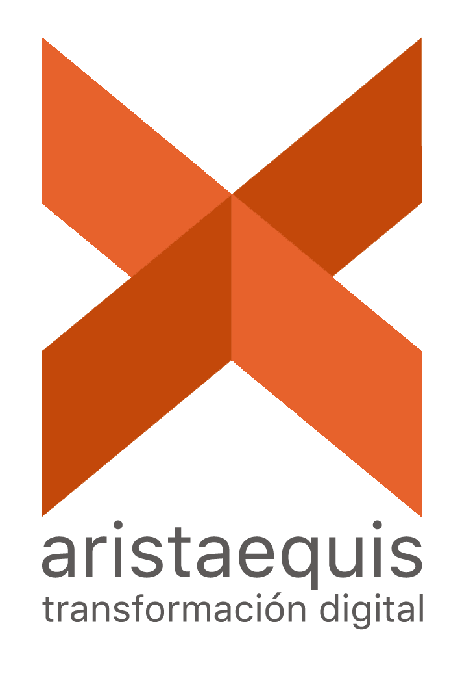
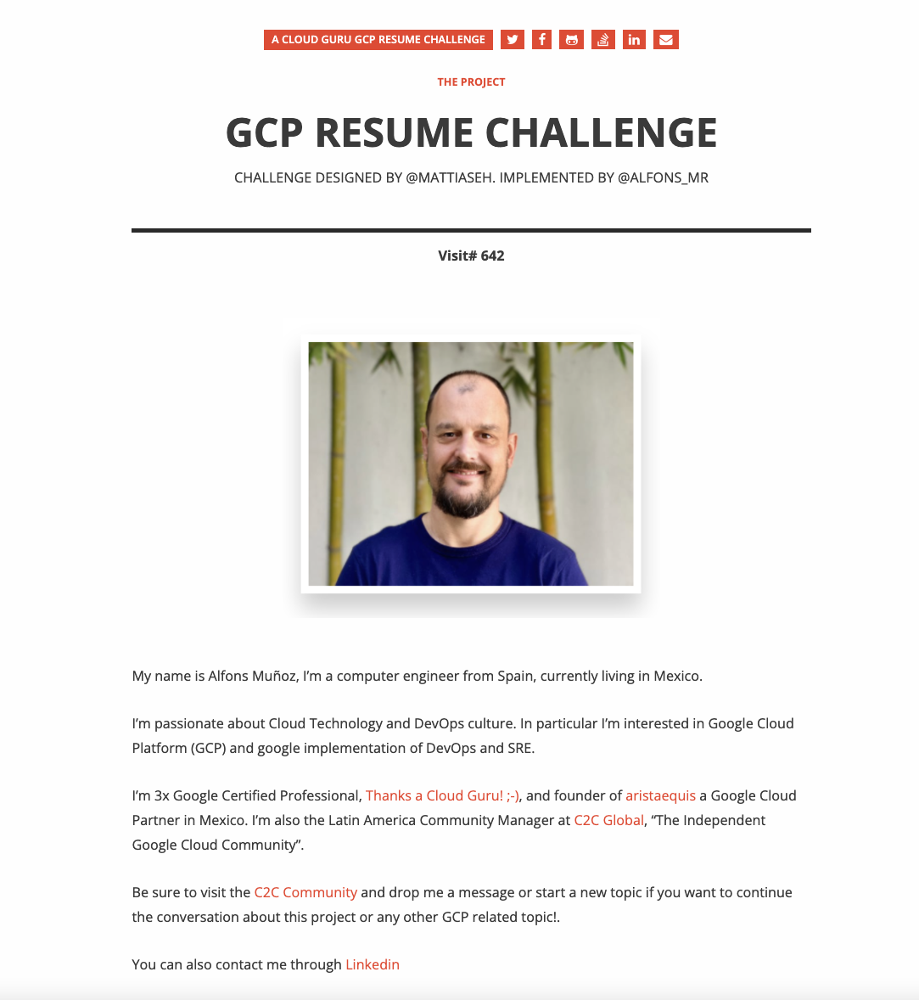
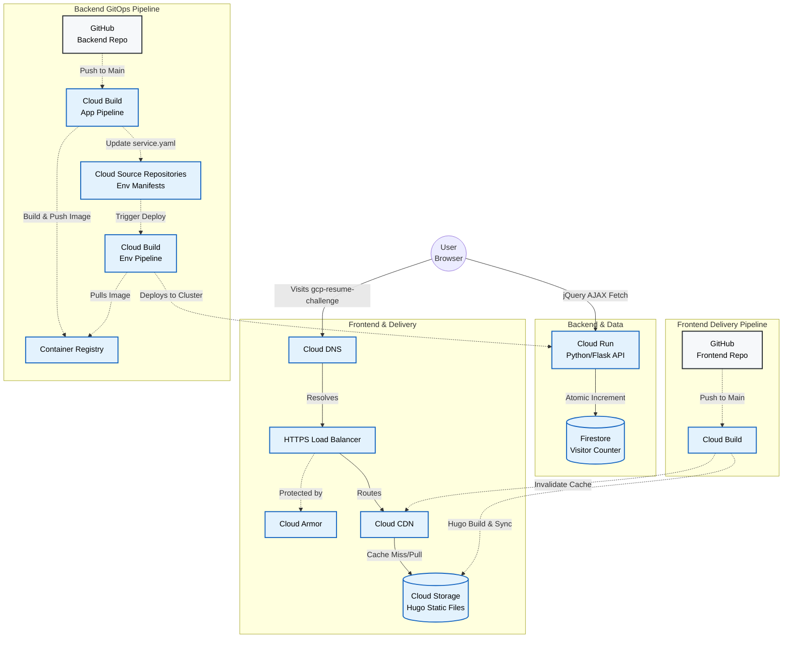

[![Contributors][contributors-shield]][contributors-url]
[![Forks][forks-shield]][forks-url]
[![Stargazers][stars-shield]][stars-url]
[![Issues][issues-shield]][issues-url]
[![MIT License][license-shield]][license-url]
[![LinkedIn][linkedin-shield]][linkedin-url]

 

  

  <h3 align="center">Serverless Personal Brand Website on GCP</h3>

  

    A comprehensive showcase of Google Cloud Platform architecture, serverless APIs, and GitOps CI/CD.
     
    <a href="https://acloudguru.com/blog/engineering/cloudguruchallenge-your-resume-on-gcp" target="_blank"><strong>View Original Challenge Description »</strong></a>
     
     
    <a href="" target="_blank"><strong>View Live Demo (Offline)</strong></a> ·
    <a href="https://github.com/alfonsmr/gcp-resume-challenge-backend" target="_blank"><strong>Backend Repository</strong></a>
  

## Overview

This project is my personal implementation of the **[Cloud Guru Challenge: Your resume on GCP](https://acloudguru.com/blog/engineering/cloudguruchallenge-your-resume-on-gcp)**. 

The goal is to build, deploy, and monitor a robust, scalable, and highly available personal brand website entirely on Google Cloud Platform. This repository contains the centralized project documentation and the **Frontend** web source code.

  

---

## Technical Architecture

This project is built mimicking enterprise-grade cloud environments, enforcing separation of concerns, infrastructure as code (IaC), and strict CI/CD guidelines.

```mermaid
flowchart TD
    %% Global Styles
    classDef gcp fill:#e3f2fd,stroke:#1565c0,stroke-width:2px,color:#000;
    classDef git fill:#f6f8fa,stroke:#24292e,stroke-width:2px,color:#000;
    
    %% User
    User((User<br/>Browser))

    %% Frontend Infrastructure
    subgraph Frontend [Frontend & Delivery]
        DNS[Cloud DNS]:::gcp
        LB[HTTPS Load Balancer]:::gcp
        Armor[Cloud Armor]:::gcp
        CDN[Cloud CDN]:::gcp
        Bucket[(Cloud Storage<br/>Hugo Static Files)]:::gcp
    end
    
    %% Connections - Delivery
    User -->|Visits gcp-resume-challenge| DNS
    DNS -->|Resolves| LB
    LB -.->|Protected by| Armor
    LB -->|Routes| CDN
    CDN -->|Cache Miss/Pull| Bucket
    
    %% Backend Infrastructure
    subgraph Backend [Backend & Data]
        Run[Cloud Run<br/>Python/Flask API]:::gcp
        DB[(Firestore<br/>Visitor Counter)]:::gcp
    end
    
    %% Connections - Telemetry
    User -->|jQuery AJAX Fetch| Run
    Run -->|Atomic Increment| DB
    
    %% CI/CD Frontend
    subgraph Frontend_CICD [Frontend Delivery Pipeline]
        GH_FE[GitHub<br/>Frontend Repo]:::git
        CB_FE[Cloud Build]:::gcp
    end
    
    %% Connections - Frontend CI/CD
    GH_FE -.->|Push to Main| CB_FE
    CB_FE -.->|Hugo Build & Sync| Bucket
    CB_FE -.->|Invalidate Cache| CDN
    
    %% CI/CD Backend GitOps
    subgraph Backend_CICD [Backend GitOps Pipeline]
        GH_BE[GitHub<br/>Backend Repo]:::git
        CB_BE1[Cloud Build<br/>App Pipeline]:::gcp
        GCR[Container Registry]:::gcp
        CSR[Cloud Source Repositories<br/>Env Manifests]:::gcp
        CB_BE2[Cloud Build<br/>Env Pipeline]:::gcp
    end

    %% Connections - Backend GitOps
    GH_BE -.->|Push to Main| CB_BE1
    CB_BE1 -.->|Build & Push Image| GCR
    CB_BE1 -.->|Update service.yaml| CSR
    CSR -.->|Trigger Deploy| CB_BE2
    CB_BE2 -.->|Pulls Image| GCR
    CB_BE2 -.->|Deploys to Cluster| Run
```

### Technology Stack & GCP Services

This ecosystem combines static web hosting, dynamic serverless compute, and extensive cloud operations integrations:

**Frontend & Delivery**
* **Framework:** [Hugo](https://gohugo.io/) (Fast Static Site Generator) using the clean "Ghostwriter" theme.
* **Storage:** [Cloud Storage](https://cloud.google.com/storage) for highly durable static website hosting.
* **Networking & Edge:**
  * [Cloud Load Balancing](https://cloud.google.com/load-balancing) for HTTPS routing.
  * [Cloud CDN](https://cloud.google.com/cdn) for global edge caching and minimal latency.
  * [Cloud Domains](https://cloud.google.com/domains/docs) & [Cloud DNS](https://cloud.google.com/dns) for domain management.
  * [Cloud Armor](https://cloud.google.com/armor) for edge security and protection against web attacks.

**Backend & Data**
* **Compute:** [Cloud Run](https://cloud.google.com/run) running a containerized Python/Flask API.
* **Database:** [Firestore](https://cloud.google.com/firestore) scaling seamlessly to track site telemetry (visitor counts) globally.

**DevOps & CI/CD**
* **Pipelines:** [Cloud Build](https://cloud.google.com/cloud-build) automating Hugo generation, content pushing, container builds, and CDN invalidations.
* **GitOps Storage:** [Cloud Source Repositories](https://cloud.google.com/source-repositories) holding backend operational deployment manifests securely.
* **Artifacts:** [Container Registry](https://cloud.google.com/container-registry) for image versioning and [Container Security](https://cloud.google.com/anthos/security) for container vulnerability scanning.

**Operations & Monitoring**
* Google Cloud Operations Suite including [Cloud Logging](https://cloud.google.com/logging), [Cloud Monitoring](https://cloud.google.com/monitoring), [Cloud Trace](https://cloud.google.com/trace), [Cloud Profiler](https://cloud.google.com/profiler), and [Cloud Debugger](https://cloud.google.com/debugger).

---

## Technical Deep-Dive

### The Frontend Engineering

The frontend is generated via Hugo, hosted on a Cloud Storage Bucket mapped to a custom domain. It includes standard resume elements, certifications, and project documentation. 
Crucially, it includes a lightweight dynamic component: a jQuery script fetching real-time visitor readouts from the Cloud Run API endpoint.

#### Continuous Integration / Delivery (CI/CD)
The frontend deployment is entirely hands-off. Upon Git push to the `main` branch, the CI pipeline automatically triggers:
1. **Cloud Build** spins up a build container environment.
2. Checks out the repository and installs the Hugo executable.
3. Compiles the static components into the `/public` directory.
4. Performs an atomic sync to the Google Cloud Storage bucket spanning the root domain.
5. Issues a cache invalidation request to **Cloud CDN** to ensure visitors immediately receive the newly updated assets.

### The Backend Engineering

The backend logic lies in an isolated Python/Flask REST API executing within a serverless **Cloud Run** container. It interfaces with **Firestore** to atomically increment and retrieve global analytics.
To learn more about the application code and the state-of-the-art dual-pipeline GitOps implementation for the container, visit the **[Backend Repository](https://github.com/alfonsmr/gcp-resume-challenge-backend)**.

---

## Roadmap

Future iterations and enhancements planned for this infrastructure:
- [ ] Implement Terraform Infrastructure-as-Code (IaC) to bootstrap the entire GCP project programmatically.
- [ ] Expand frontend automation to include integration testing.
- [ ] Consolidate full end-to-end testing metrics in the CI pipelines.
- [ ] Unify repositories while retaining GitOps separation for manifests.
- [ ] Define Service Level Objectives (SLOs) and dynamic alerting via Cloud Monitoring.
- [ ] Create staging & preview environments through branching strategies.

## About the Author

**Alfons Muñoz**  
*Program Manager & Cloud Architect*

I am a Program Manager, Cloud Architect, and 5x Google Cloud Certified Professional from Spain, currently based in Mexico. I am passionate about cloud technology, SRE principles, and building scalable architectures. I founded [aristaequis](http://www.aristaequis.com) (a Google Cloud Partner) and am the Community Director at [C2C Global](https://bit.ly/3AJLbrI).

Feel free to connect or ask questions about this architecture:
* [Drop a message in the C2C Community](https://bit.ly/3AJLbrI)
* [Connect on LinkedIn](https://www.linkedin.com/in/alfonsmr/)
* [Check out my A Cloud Guru Profile](https://learn.acloud.guru/profile/alfonsmr)
* [Follow me on Twitter](https://twitter.com/alfons_mr)

## License

Distributed under the MIT License. See `LICENSE` for more information.

<!-- MARKDOWN LINKS & IMAGES -->
[contributors-shield]: https://img.shields.io/github/contributors/alfonsmr/gcp-resume-challenge-frontend
[contributors-url]: https://github.com/alfonsmr/gcp-resume-challenge-frontend/graphs/contributors
[forks-shield]: https://img.shields.io/github/forks/alfonsmr/gcp-resume-challenge-frontend
[forks-url]: https://github.com/alfonsmr/gcp-resume-challenge-frontend/network/members
[stars-shield]: https://img.shields.io/github/stars/alfonsmr/gcp-resume-challenge-frontend
[stars-url]: https://github.com/alfonsmr/gcp-resume-challenge-frontend/stargazers
[issues-shield]: https://img.shields.io/github/issues/alfonsmr/gcp-resume-challenge-frontend
[issues-url]: https://github.com/alfonsmr/gcp-resume-challenge-frontend/issues
[license-shield]: https://img.shields.io/github/license/alfonsmr/gcp-resume-challenge-frontend
[license-url]: https://github.com/alfonsmr/gcp-resume-challenge-frontend/blob/master/LICENSE
[linkedin-shield]: https://img.shields.io/badge/-LinkedIn-black.svg?style=for-the-badge&logo=linkedin&colorB=555
[linkedin-url]: https://linkedin.com/in/alfonsmr